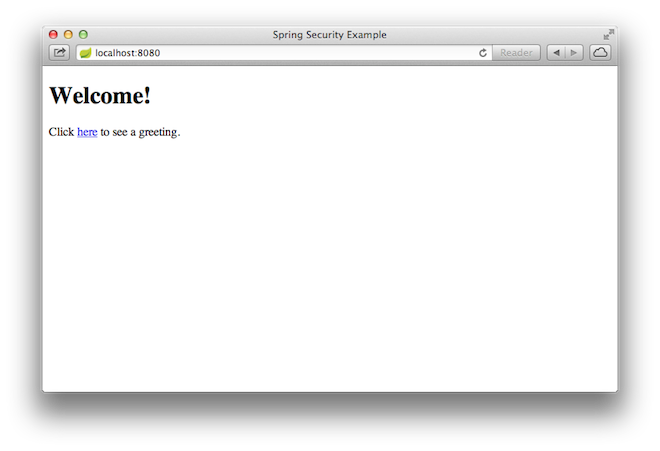
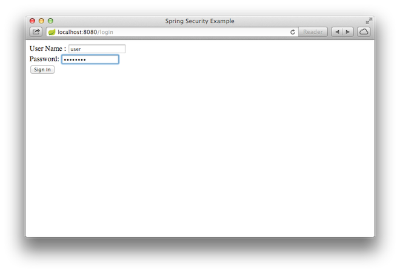
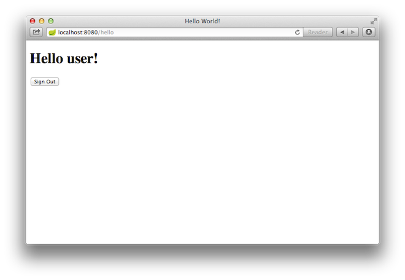

# 保护web应用的安全

> 原文：[Securing a Web Application](https://spring.io/guides/gs/securing-web/)
>
> 译者：[徐靖峰](https://github.com/lexburner)
>
> 校对：[程序猿DD](https://github.com/dyc87112/)

本指南将引导你使用Spring Security来保护Web应用的安全。

## 你将要构建什么

你将构建一个Spring MVC应用程序，该应用程序使用一些固定的用户，支持表单登录的形式来保护页面。

## 你需要什么

- 约15分钟
- 一个你喜欢的文本编辑器或IDE
- JDK≥1.8
- [Gradle 2.3+](http://www.gradle.org/downloads) or [Maven 3.0+](https://maven.apache.org/download.cgi)
- 你也可以将代码直接导入你的IDE:
  - [Spring Tool Suite (STS)](https://spring.io/guides/gs/sts)
  - [IntelliJ IDEA](https://spring.io/guides/gs/intellij-idea/)

## 如何完成这篇指南

像大多数的Spring指南 [Getting Started guides](https://spring.io/guides),你可以从头开始，完成每一步，也可以跳过已经熟悉的基本设置。 无论哪种方式，你都会得到起作用的代码。

 **start from scratch**, 移步 [Build with Gradle](https://spring.io/guides/gs/securing-web/#scratch).

**跳过基础部分**, 执行以下操作:

- [下载](https://github.com/spring-guides/gs-securing-web/archive/master.zip) 并解压本仓库的源码, 或者使用 [Git](https://spring.io/understanding/Git): `git clone https://github.com/spring-guides/gs-securing-web.git` 
- 进入 `gs-securing-web/initial`
- 前往 [Set up Spring Security](https://spring.io/guides/gs/securing-web/#initial).

**当你完成后**, 你可以和此处的代码进行对比 `gs-securing-web/complete`.

## 使用Gradle构建

首先你得安装基础的构建脚本. 你可以使用任意你喜欢的构建系统去构建Spring应用, 你使用 Gradle 和 Maven构建需要的代码在本文提供: [Gradle](http://gradle.org/) and [Maven](https://maven.apache.org/) . 如果你对两者都不熟悉,可以先参考[Building Java Projects with Gradle](https://spring.io/guides/gs/gradle) 或者 [Building Java Projects with Maven](https://spring.io/guides/gs/maven).

### 创建目录结构

在你选择的项目目录中，创建以下子目录结构;例如, 在Linux/Unix系统中使用如下命令: `mkdir -p src/main/java/hello` 

```
└── src
    └── main
        └── java
            └── hello
```

### 创建一个Gradle文件

如下是一个 [Gradle初始化文件](https://github.com/spring-guides/gs-securing-web/blob/master/initial/build.gradle).

`build.gradle`

```groovy
buildscript {
    repositories {
        mavenCentral()
    }
    dependencies {
        classpath("org.springframework.boot:spring-boot-gradle-plugin:1.5.7.RELEASE")
    }
}

apply plugin: 'java'
apply plugin: 'eclipse'
apply plugin: 'idea'
apply plugin: 'org.springframework.boot'

jar {
    baseName = 'gs-securing-web'
    version =  '0.1.0'
}

repositories {
    mavenCentral()
}

sourceCompatibility = 1.8
targetCompatibility = 1.8

dependencies {
    compile("org.springframework.boot:spring-boot-starter-thymeleaf")
    testCompile("junit:junit")
    testCompile("org.springframework.boot:spring-boot-starter-test")
    testCompile("org.springframework.security:spring-security-test")

}
```

 [Spring Boot gradle 插件](https://github.com/spring-projects/spring-boot/tree/master/spring-boot-tools/spring-boot-gradle-plugin) 提供了很多便捷的特性:

- 它收集类路径上的所有jar包，并构建一个可运行的jar包，这样可以更方便地执行和发布服务。
- 它寻找`public static void main()` 方法并标记为一个可执行的类.
- 它提供了一个内置的依赖解析器，将应用与Spring Boot依赖的版本号进行匹配。你可以修改成任意的版本，但它将默认为Boot所选择的一组版本。

## 使用Maven构建

First you set up a basic build script. You can use any build system you like when building apps with Spring, but the code you need to work with [Maven](https://maven.apache.org/) is included here. If you’re not familiar with Maven, refer to [Building Java Projects with Maven](https://spring.io/guides/gs/maven).

### 创建目录结构

在你选择的项目目录中，创建以下子目录结构;例如, 在Linux/Unix系统中使用如下命令: `mkdir -p src/main/java/hello` 

```
└── src
    └── main
        └── java
            └── hello
```

`pom.xml`

```xml
<?xml version="1.0" encoding="UTF-8"?>
<project xmlns="http://maven.apache.org/POM/4.0.0" xmlns:xsi="http://www.w3.org/2001/XMLSchema-instance"
    xsi:schemaLocation="http://maven.apache.org/POM/4.0.0 http://maven.apache.org/xsd/maven-4.0.0.xsd">
    <modelVersion>4.0.0</modelVersion>

    <groupId>org.springframework</groupId>
    <artifactId>gs-securing-web</artifactId>
    <version>0.1.0</version>

    <parent>
        <groupId>org.springframework.boot</groupId>
        <artifactId>spring-boot-starter-parent</artifactId>
        <version>1.5.7.RELEASE</version>
    </parent>

    <dependencies>
        <dependency>
            <groupId>org.springframework.boot</groupId>
            <artifactId>spring-boot-starter-thymeleaf</artifactId>
        </dependency>
        <dependency>
            <groupId>org.springframework.boot</groupId>
            <artifactId>spring-boot-starter-test</artifactId>
            <scope>test</scope>
        </dependency>
        <dependency>
            <groupId>org.springframework.security</groupId>
            <artifactId>spring-security-test</artifactId>
            <scope>test</scope>
        </dependency>
    </dependencies>

    <properties>
        <java.version>1.8</java.version>
    </properties>


    <build>
        <plugins>
            <plugin>
                <groupId>org.springframework.boot</groupId>
                <artifactId>spring-boot-maven-plugin</artifactId>
            </plugin>
        </plugins>
    </build>

    <repositories>
        <repository>
            <id>spring-releases</id>
            <name>Spring Releases</name>
            <url>https://repo.spring.io/libs-release</url>
        </repository>
    </repositories>
    <pluginRepositories>
        <pluginRepository>
            <id>spring-releases</id>
            <name>Spring Releases</name>
            <url>https://repo.spring.io/libs-release</url>
        </pluginRepository>
    </pluginRepositories>

</project>
```

 [Spring Boot Maven 插件](https://github.com/spring-projects/spring-boot/tree/master/spring-boot-tools/spring-boot-maven-plugin) 提供了很多便捷的特性:

- 它收集类路径上的所有jar包，并构建一个可运行的jar包，这样可以更方便地执行和发布服务。
- 它寻找`public static void main()` 方法并标记为一个可执行的类.
- 它提供了一个内置的依赖解析器，将应用与Spring Boot依赖的版本号进行匹配。你可以修改成任意的版本，但它将默认为Boot所选择的一组版本。

## 使用你的IDE构建

- 阅读如何导入这篇指南进入你的IDE [Spring Tool Suite](https://spring.io/guides/gs/sts/).
- 阅读如何使用 [IntelliJ IDEA](https://spring.io/guides/gs/intellij-idea) 来构建.

## 创建一个不受安全保护的web应用

在保护Web应用程序安全之前，您需要安装Web应用程序。 本节将引导你创建一个非常简单的Web应用程序。 然后在下一节中使用Spring Security来保护它。

Web应用程序包括两个简单的视图：主页和“Hello World”页面。 主页定义在如下的Thymeleaf模板中：

`src/main/resources/templates/home.html`

```html
<!DOCTYPE html>
<html xmlns="http://www.w3.org/1999/xhtml" xmlns:th="http://www.thymeleaf.org" xmlns:sec="http://www.thymeleaf.org/thymeleaf-extras-springsecurity3">
    <head>
        <title>Spring Security Example</title>
    </head>
    <body>
        <h1>Welcome!</h1>

        <p>Click <a th:href="@{/hello}">here</a> to see a greeting.</p>
    </body>
</html>
```

我们可以看到, 在这个简单的视图中包含了一个链接： "/hello". 链接到了如下的页面，Thymeleaf模板如下:

`src/main/resources/templates/hello.html`

```html
<!DOCTYPE html>
<html xmlns="http://www.w3.org/1999/xhtml" xmlns:th="http://www.thymeleaf.org"
      xmlns:sec="http://www.thymeleaf.org/thymeleaf-extras-springsecurity3">
    <head>
        <title>Hello World!</title>
    </head>
    <body>
        <h1>Hello world!</h1>
    </body>
</html>
```

The web application is based on Spring MVC. Thus you need to configure Spring MVC and set up view controllers to expose these templates. Here’s a configuration class for configuring Spring MVC in the application.

Web应用程序基于Spring MVC。 因此，你需要配置Spring MVC并设置视图控制器来暴露这些模板。 如下是一个典型的Spring MVC配置类。

`src/main/java/hello/MvcConfig.java`

```java
package hello;

import org.springframework.context.annotation.Configuration;
import org.springframework.web.servlet.config.annotation.ViewControllerRegistry;
import org.springframework.web.servlet.config.annotation.WebMvcConfigurerAdapter;

@Configuration
public class MvcConfig extends WebMvcConfigurerAdapter {

    @Override
    public void addViewControllers(ViewControllerRegistry registry) {
        registry.addViewController("/home").setViewName("home");
        registry.addViewController("/").setViewName("home");
        registry.addViewController("/hello").setViewName("hello");
        registry.addViewController("/login").setViewName("login");
    }

}
```

`addViewControllers()`方法（覆盖`WebMvcConfigurerAdapter`中同名的方法）添加了四个视图控制器。 两个视图控制器引用名称为“home”的视图（在`home.html`中定义），另一个引用名为“hello”的视图（在`hello.html`中定义）。 第四个视图控制器引用另一个名为“login”的视图。 您将在下一部分中创建该视图。

此时，您可以跳过来使应用程序可执行并运行应用程序，而无需登录任何内容。

创建基本的简单Web应用程序后，可以添加安全性。

## 安装 Spring Security

假设你希望防止未经授权的用户访问“/ hello”。 此时，如果用户点击主页上的链接，他们会看到问候语，请求被没有被拦截。 你需要添加一个障碍，使得用户在看到该页面之前登录。

您可以通过在应用程序中配置Spring Security来实现。 如果Spring Security在类路径上，则Spring Boot会使用“Basic认证”来自动保护所有HTTP端点。 同时，你可以进一步自定义安全设置。 你需要做的第一件事是将Spring Security添加到类路径中。

使用Gradle：

`build.gradle`

```groovy
dependencies {
    ...
    compile("org.springframework.boot:spring-boot-starter-security")
    ...
}
```

使用maven，需要添加到 `<dependencies>`节点中 :

`pom.xml`

```xml
<dependencies>
    ...
        <dependency>
            <groupId>org.springframework.boot</groupId>
            <artifactId>spring-boot-starter-security</artifactId>
        </dependency>
    ...
</dependencies>
```

如下是安全配置，使得只有认证过的用户才可以访问到问候页面:

`src/main/java/hello/WebSecurityConfig.java`

```java
package hello;

import org.springframework.beans.factory.annotation.Autowired;
import org.springframework.context.annotation.Configuration;
import org.springframework.security.config.annotation.authentication.builders.AuthenticationManagerBuilder;
import org.springframework.security.config.annotation.web.builders.HttpSecurity;
import org.springframework.security.config.annotation.web.configuration.WebSecurityConfigurerAdapter;
import org.springframework.security.config.annotation.web.configuration.EnableWebSecurity;

@Configuration
@EnableWebSecurity
public class WebSecurityConfig extends WebSecurityConfigurerAdapter {
    @Override
    protected void configure(HttpSecurity http) throws Exception {
        http
            .authorizeRequests()
                .antMatchers("/", "/home").permitAll()
                .anyRequest().authenticated()
                .and()
            .formLogin()
                .loginPage("/login")
                .permitAll()
                .and()
            .logout()
                .permitAll();
    }

    @Autowired
    public void configureGlobal(AuthenticationManagerBuilder auth) throws Exception {
        auth
            .inMemoryAuthentication()
                .withUser("user").password("password").roles("USER");
    }
}
```

`WebSecurityConfig`类使用了`@EnableWebSecurity`注解 ，以启用Spring Security的Web安全支持，并提供Spring MVC集成。它还扩展了`WebSecurityConfigurerAdapter`，并覆盖了一些方法来设置Web安全配置的一些细节。

`configure(HttpSecurity)`方法定义了哪些URL路径应该被保护，哪些不应该。具体来说，“/”和“/ home”路径被配置为不需要任何身份验证。所有其他路径必须经过身份验证。

当用户成功登录时，它们将被重定向到先前请求的需要身份认证的页面。有一个由 `loginPage()`指定的自定义“/登录”页面，每个人都可以查看它。

对于`configureGlobal(AuthenticationManagerBuilder)` 方法，它将单个用户设置在内存中。该用户的用户名为“user”，密码为“password”，角色为“USER”。

现在我们需要创建登录页面。前面我们已经配置了“login”的视图控制器，因此现在只需要创建登录页面即可：

`src/main/resources/templates/login.html`

```html
<!DOCTYPE html>
<html xmlns="http://www.w3.org/1999/xhtml" xmlns:th="http://www.thymeleaf.org"
      xmlns:sec="http://www.thymeleaf.org/thymeleaf-extras-springsecurity3">
    <head>
        <title>Spring Security Example </title>
    </head>
    <body>
        <div th:if="${param.error}">
            Invalid username and password.
        </div>
        <div th:if="${param.logout}">
            You have been logged out.
        </div>
        <form th:action="@{/login}" method="post">
            <div><label> User Name : <input type="text" name="username"/> </label></div>
            <div><label> Password: <input type="password" name="password"/> </label></div>
            <div><input type="submit" value="Sign In"/></div>
        </form>
    </body>
</html>
```

你可以看到，这个Thymeleaf模板只是提供一个表单来获取用户名和密码，并将它们提交到“/ login”。 根据配置，Spring Security提供了一个拦截该请求并验证用户的过滤器。 如果用户未通过认证，该页面将重定向到“/ login?error”，并在页面显示相应的错误消息。 注销成功后，我们的应用程序将发送到“/ login?logout”，我们的页面显示相应的登出成功消息。

最后，我们需要向用户提供一个显示当前用户名和登出的方法。 更新`hello.html` 向当前用户打印一句hello，并包含一个“注销”表单，如下所示:

`src/main/resources/templates/hello.html`

```html
<!DOCTYPE html>
<html xmlns="http://www.w3.org/1999/xhtml" xmlns:th="http://www.thymeleaf.org"
      xmlns:sec="http://www.thymeleaf.org/thymeleaf-extras-springsecurity3">
    <head>
        <title>Hello World!</title>
    </head>
    <body>
        <h1 th:inline="text">Hello [[${#httpServletRequest.remoteUser}]]!</h1>
        <form th:action="@{/logout}" method="post">
            <input type="submit" value="Sign Out"/>
        </form>
    </body>
</html>
```

我们使用Spring Security与`HttpServletRequest#getRemoteUser()`的集成来显示用户名。 “登出”表单将POST请求提交到“/ logout”。 成功注销后，会将用户重定向到“/ login?logout”。

## 让应用跑起来

虽然可以将此服务打包成传统的Web应用程序或[WAR](https://spring.io/understanding/WAR) 包以部署到外部的应用服务器，但下面将演示一种更简单的方法，创建一个独立的应用程序。 所有内容都将包装在一个可执行的JAR文件中，并使用Java的main()方法驱动。 这样，你就可以使用Spring提供的内嵌Tomcat servlet容器，来运行HTTP服务，而不是部署到外部实例。

`src/main/java/hello/Application.java`

```java
package hello;

import org.springframework.boot.SpringApplication;
import org.springframework.boot.autoconfigure.SpringBootApplication;

@SpringBootApplication
public class Application {

    public static void main(String[] args) throws Throwable {
        SpringApplication.run(Application.class, args);
    }

}
```

`@SpringBootApplication` 是一个便捷的注解，它包含了如下的作用:

- `@Configuration` 标记了该类为Spring应用上下文定义Bean的源头.
- `@EnableAutoConfiguration` 告诉Spring Boot基于类路径，其他类，多种设置添加Bean的定义.
- 通常你需要为Spring MVC应用添加 `@EnableWebMvc`注解 , 但springboot如果发现类路径下存在**spring-webmvc** 的依赖，其会自动添加web的支持. 这便将应用标记为了一个web应用 并且激活了核心的配置如 `DispatcherServlet`.
- `@ComponentScan` 告诉Spring去扫描位于`hello` 包下的其他组件，配置和服务( components, configurations, and services), 同时让它去寻找控制器(controllers).

 `main()` 方法使用Spring Boot的 `SpringApplication.run()` 方法去运行应用. 发现没有，我们没有写任何一行XML?也不存在 **web.xml** 文件. 这个web应用100%都是 Java 并且你不必配置任何基础设施。

### 构建可执行的JAR包

你可以使用Gradle或Maven，从命令行运行应用程序。 或者，你可以构建一个包含所有依赖，类和资源的单个可执行JAR文件，并运行该文件。 这使得在整个开发生命周期中，可以很方便地跨不同的环境和版本，和部署服务成为一个应用程序。

如果你使用gradle, 你可以使用 `./gradlew bootRun`命令运行. 或者你可以使用 `./gradlew build`构建一个JAR . 然后你可以运行这个 JAR文件:

```shell
java -jar build/libs/gs-securing-web-0.1.0.jar
```

如果你使用maven, 你可以使用 `./mvnw spring-boot:run`命令运行. 或者你可以使用 `./mvnw clean package`构建一个JAR. 然后你可以运行这个 JAR文件:

```shell
java -jar target/gs-securing-web-0.1.0.jar
```


> The procedure above will create a runnable JAR. You can also opt to [build a classic WAR file](https://spring.io/guides/gs/convert-jar-to-war/)instead.


```
... app starts up ...
```

应用启动后, 在浏览器中访问 [http://localhost:8080](http://localhost:8080/). 你可以访问到首页:



当你点击链接,他将会让你试图去访问 `/hello`. 但因为该页面是受保护的，所以你需要登录, 于是来到了登录页面。



> 如果您使用未收保护的代码版本访问此处，那么你将看不到此登录页面。 随时备份和编写其余的受安全保护的代码。

在登录页面，分别输入用户名和密码字段的"user"和"password"作为测试用户登录。 提交登录表单后，你将进行身份认证，然后转到问候页面：



如果点击“退出”按钮，您的身份认证将被注销，并返回到登录页面，并显示一条消息，提示你已注销。

## 总结

恭喜！ 你已经开发了一个使用Spring Security保护的简单Web应用程序。

## 发现

以下指南也可能有帮助：

- [使用SpringBoot构建应用程序](https://spring.io/guides/gs/spring-boot/)
- [使用Spring MVC提供Web内容](https://spring.io/guides/gs/serving-web-content/)
- [Spring Security 架构](https://spring.io/guides/topicals/spring-security-architecture/) (Reference guide)
- [Spring Security and Angular JS](https://spring.io/guides/tutorials/spring-security-and-angular-js/) (Tutorial)


> 本文由spring4all.com翻译小分队创作，采用[知识共享-署名-非商业性使用-相同方式共享 4.0 国际 许可](http://creativecommons.org/licenses/by-nc-sa/4.0/)协议进行许可。

